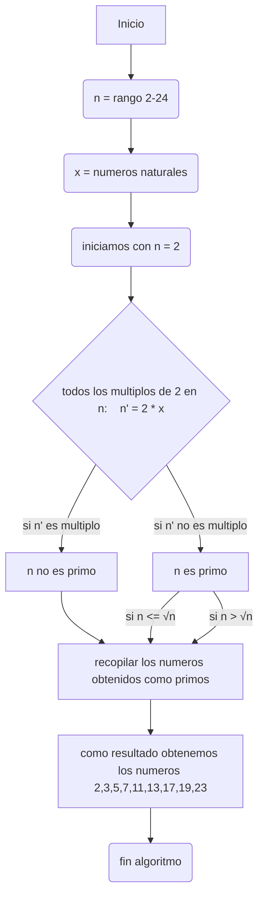

# RETO_3
## En este repositorio se encuentran los pasos a seguir para hallar los números primos, esta serie de pasos esta basada en la Criba de Eratóstenes.
### Pasos a seguir:
### 1. Creamos una lista de números naturales desde **2** hasta **n**, en este caso tomaremos como ejemplo **n=24**.

*[2, 3, 4, 5, 6, 7, 8, 9, 10, 11, 12, 13, 14, 15, 16, 17, 18, 19, 20, 21, 22, 23, 24]*


### 2. Seleccionamos el primer número de la lista **"i"**.
En este caso **i=2**.


### 3. Eliminamos todos los multiplos de **i** hasta n (exepto el número mismo) de la lista.

 *[2, 3, ~~4~~ , 5 , ~~6~~ , 7 , ~~8~~ , 9 , ~~10~~ , 11 , ~~12~~ , 13 , ~~14~~ , 15 , ~~16~~ , 17 , ~~18~~ , 19 , ~~20~~ , 21 , ~~22~~ , 23 , ~~24~~]*


 ### 4. Creamos otra lista **n'** con los números que no se eliminaron exeptuando a los **i** que ya se utilizaron. 

 *[3, 5, 7, 9, 11, 13, 15, 17, 19, 21, 23]*
 

### 5. Repetimos los pasos **2**, **3** y **4** hasta que **i > **√n**


### 6. Recopilamos los **i** utilizados junto a la ultima lista del **paso 4**. 

***[2, 3, 5, 7, 11, 13, 17, 19, 23]***

### 7. Finalizar


## La lista obtenida en el paso 6 contiene a los números primos desde **2** hasta **n**.

#### PSEUCODE
```pseudode
# definir n
x = N >= 2
n = x in [2 , 24]
i = n 
# i toma el primer valor del rango de n 
i = 2
#eliminamos a los multiplos de i hasta n (exepto los i utilizados anteriormente)
 escribir("no_es_primo") si i*x = n' 
#se repiten los pasos 2, 3 y 4 hasta que i >= n^0.5
#si i >= n^0.5 se recpilan los numeros que no se han eliminado
escribir ("es_primo") 
Fin
FinAlgoritmo
```
### Diagrama de flujo



